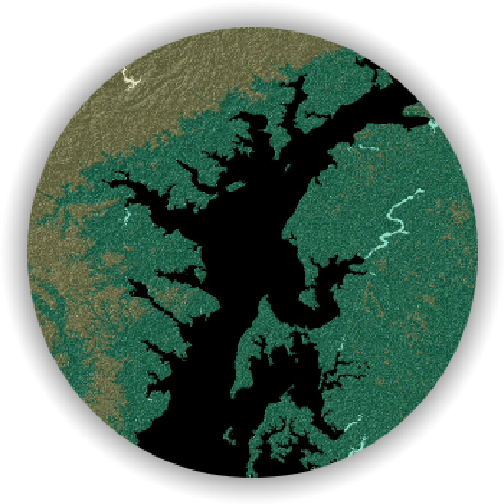

<!--This is the first row of projects -->

### Zoning In Baltimore

[See more details here.](https://gmulea1.github.io/project_1/project1.html)

This is an analysis of the distribution of zoning types versus the distancce from the Patapsco River.   

<small>__Tools__: QGIS, QGIS2ThreeJs</small>

<small>__Data__: 
[Baltimore Real Property Dataset](http://gis-baltimore.opendata.arcgis.com/datasets/b41551f53345445fa05b554cd77b3732_0)</small>

### Project 2

[See more details here.](https://gmulea1.github.io/project_2/project2.html)

This is a display of elevation in Maryland 

<small>__Tools__: QGIS</small>

<small>__Data__:
Maryland DEM</small>

<!--This is the second row of projects -->

### Land Use Change in Baltimore

[See more details here.](https://gmulea1.github.io/project_3/project3.html)

This project looks at the change in Land Use in Baltimore County from 1973 to 2010.  

<small>__Tools__: QGIS, Photoshop

<small>__Data__: 
[Maryland Archived Land Use Land Cover 1973](http://data.imap.maryland.gov/datasets/maryland-archived-land-use-land-cover-1973), [Maryland Archived Land Use Land Cover 2002](http://data.imap.maryland.gov/datasets/maryland-archived-land-use-land-cover-2002), [Maryland Land Use Land Cover - Land Use Land Cover 2010](http://data.imap.maryland.gov/datasets/maryland-land-use-land-cover-land-use-land-cover-2010)</small>

### Project 4

[See more details here.](https://gmulea1.github.io/project_4/project4.html)

Phasellus consequat quam elit, et iaculis risus pellentesque aliquet. Proin ut enim dui. Ut elementum, purus nec rhoncus sagittis, nibh nunc auctor nulla, eu condimentum nisi velit eget magna. Nulla feugiat tincidunt dictum. Vestibulum congue sapien elit. Maecenas non sodales ligula, quis tempor mi. 

<small>__Tools__: QGIS, R

<small>__Data__:
[Census Streets](https://www.census.gov/cgi-bin/geo/shapefiles/index.php), US Business Directory (defunct)</small>

