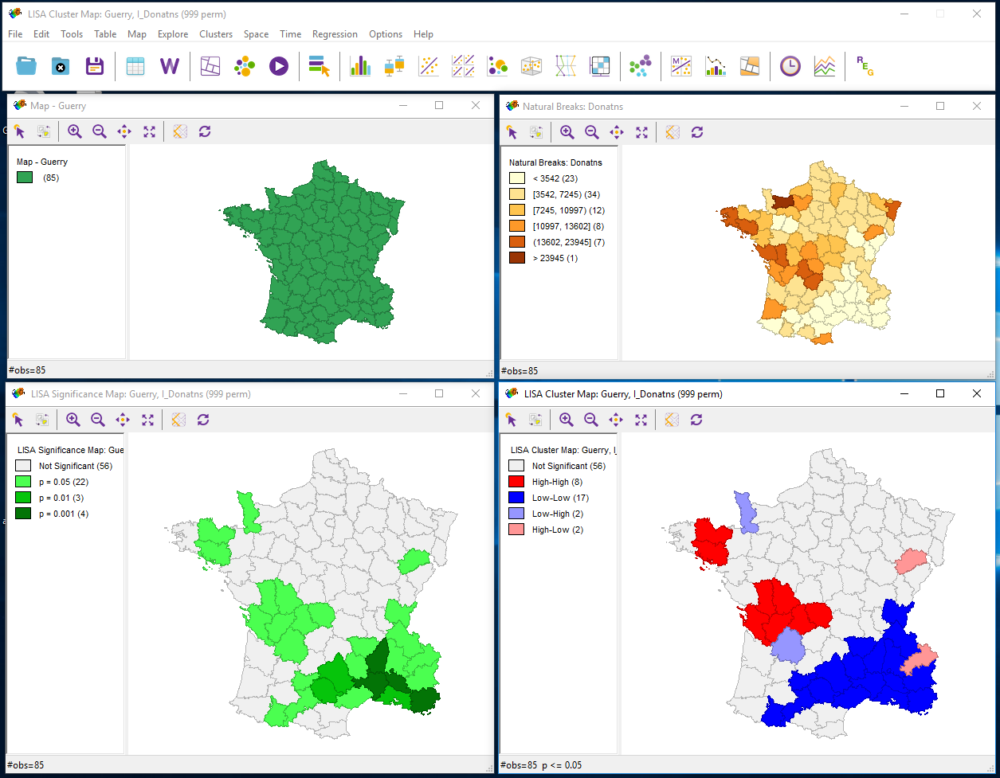
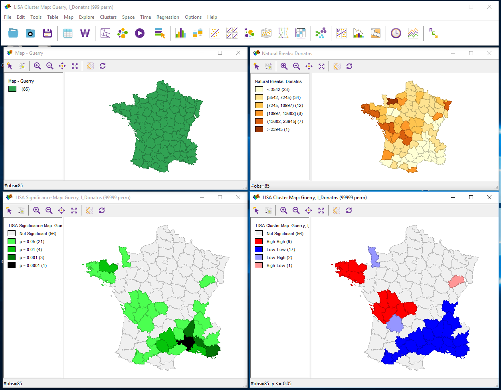
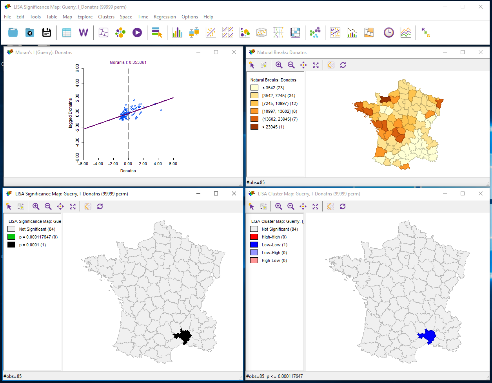
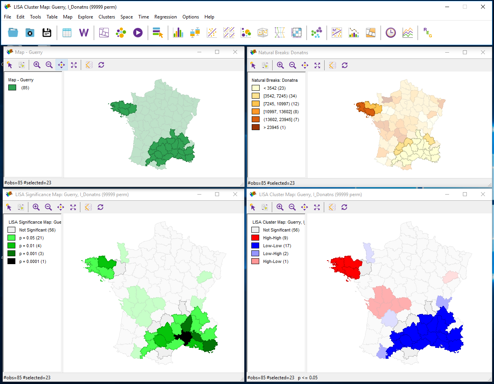
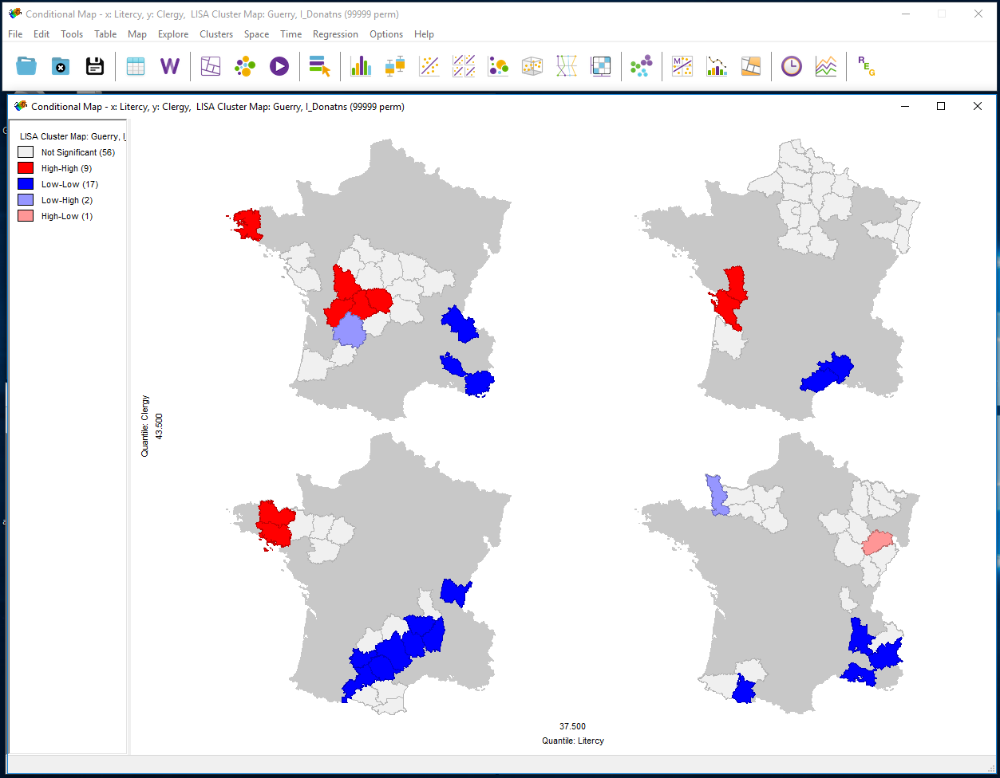
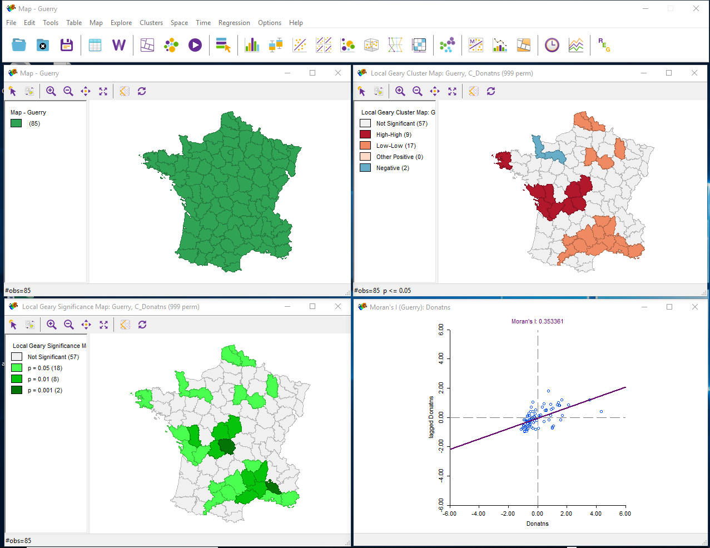
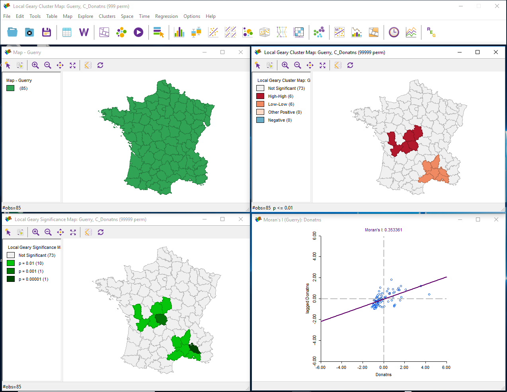
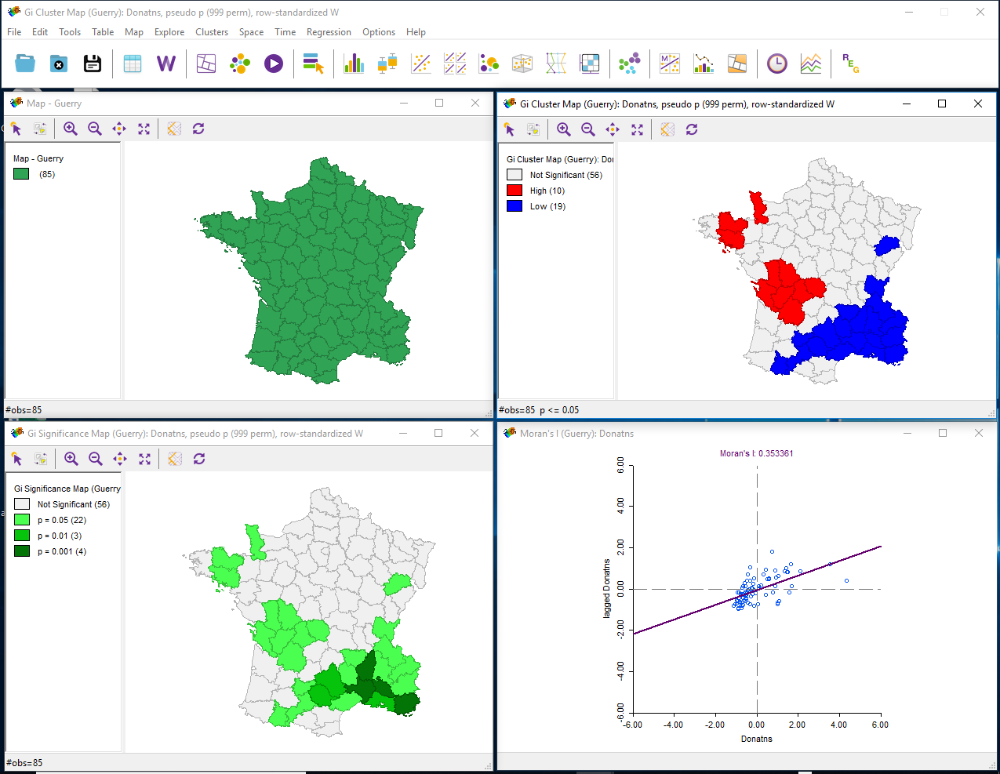
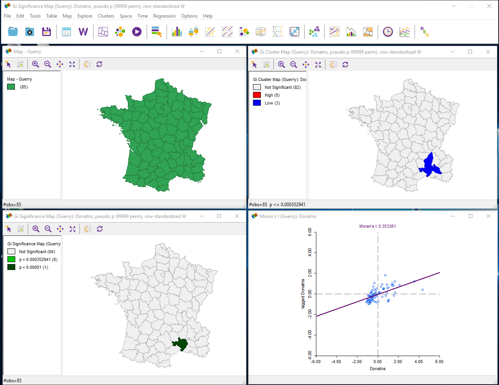
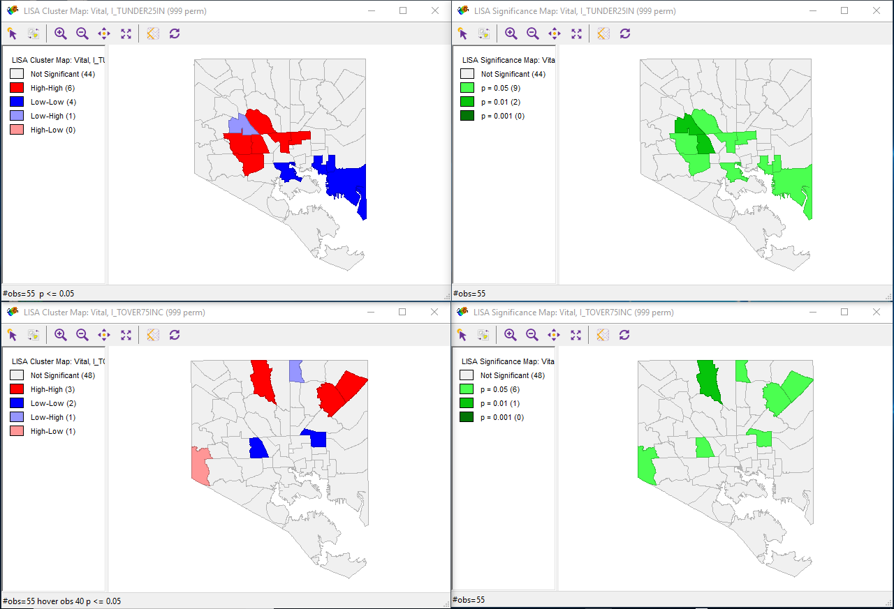

## Lab 6
Gregory Mulea

### Part 1
**Screenshots:**

Cluster Map 999 Permutations

Cluster Map 99999 Permutations

Low - High

Bonferroni Map

False Discovery Rate Map

Cores and Neighbors

Conditional Map

Local Guerry Map

Local Guerry Map with Negative Highlighted

Guerry Map with 99999 Permutations and a Significance of 0.01

Getis-Ord Map 999 Permutations

Getis-Ord Map 99999 Permutations and Significance from FDR

### Part 2/3
First I used QGIS to link the bottom section to its neighbors to properly create a full analysis.  I decided to look at the difference between households with a median income of either greater than $75,000 or under $25,000.  In order to do this I divided the percentage values by 100 and multiplied it by the total population.  Than I ran a basic cluster analysis on both of those to create cluster maps.

`Under $25,000 (Top) versus Over $75,000 (Bottom)`

This shows that in areas that have a lot of households under $25,000 are located mostly in the North West area of the middle of Baltimore City in a large cluster.  Areas with a lot of households above $75,000 are more scattered around the edges of the city.

I am overall proud of what I did because I was able to edit the shapefile to ensure the bottom section is included in the analysis and also editing the table through GeoDa to give me useful numbers to run an analysis.
