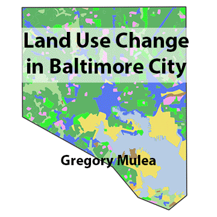

## Project 2 - Gregory Mulea
### Change in Baltimore City Land Use Over Time

---



In this project I analyzed 3 different land use shapefiles from different times in Baltimore City.  The three years I analyzed are 1973, 2002, and 2010.  First I had to reclassify the shapefiles to convert the code numbers to strings such as Residential, Commercial, Industrial, etc.  I then had to load in the shapefiles and I used python to load all three at the same time and add an already made styles.

Here is the simple python script: `load.py`
```python
years = ['1973','2002','2010']
for year in years:
    lu = QgsVectorLayer('Z:/486Workspace/project_2/shapefiles/LU' + year + '.shp', 'LU' + year, 'ogr')
    QgsProject.instance().addMapLayer(lu)
    lu.loadNamedStyle('Z:/486Workspace/project_2/data/LU' + year + 'style.qml')
```

Next I simplified the codes as there where about three codes that related to Residential land use so I converted that to one code.  In total I had 12 different types of land use.

I then converted each shapefile into a raster using the simplified codes as the value of the raster.  I used the raster calculator and a simple formula `"1973@1" = "2002@1"` to determine if the land use changed between the three rasters.  This gives a value of 1 where the two rasters are equal and a value of 0 where the rasters changed.
