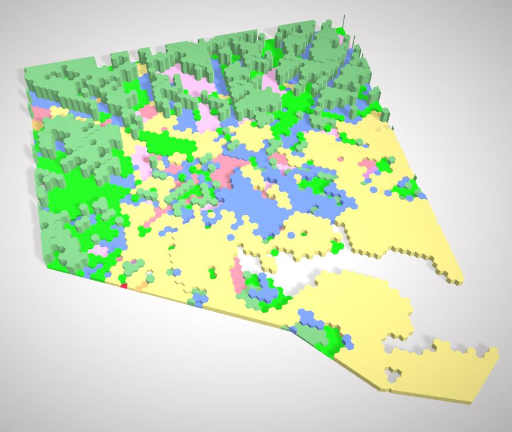

In this project, I am analyzing the distribution of zones versus the distance from the Patapsco River.

In order to achieve this analysis I used the real_property dataset from the Baltimore City Open Data Source.

First I had to sort and reclassify the zoning column to fit the categories of Commercial, Residential, Industrial, Open Space, Office, Education, Transit, Historic, and Other.  I used a case - when function within the field calculator.

<i>Click to View case - when </i>

<blockquote> case  
when "zonecode" = 'C-1' then 'Commercial' 
when "zonecode" = 'C-1VC' then 'Commercial' 
when "zonecode" = 'C-2' then 'Commercial' 
when "zonecode" = 'C-4' then 'Commercial' 
when "zonecode" = 'C-5IH' then 'Commercial' 
when "zonecode" = 'C-5HT' then 'Commercial' 
when "zonecode" = 'C-5TO' then 'Commercial' 
when "zonecode" = 'C-5HS' then 'Commercial' 
when "zonecode" = 'C-5DC' then 'Commercial' 
when "zonecode" = 'C-3' then 'Commercial' 
when "zonecode" = 'C-2*' then 'Commercial' 
when "zonecode" = 'C-1E*' then 'Commercial' 
when "zonecode" = 'C-5DC*' then 'Commercial' 
when "zonecode" = 'C5TO*' then 'Commercial' 
when "zonecode" = 'C-5-G' then 'Commercial' 
when "zonecode" = 'C-1-E' then 'Commercial' 
when "zonecode" = 'C-5DE' then 'Commercial' 
when "zonecode" = 'BSC' then 'Education' 
when "zonecode" = 'EC-2' then 'Education' 
when "zonecode" = 'EC-1' then 'Education' 
when "zonecode" = 'H' then 'Historic' 
when "zonecode" = 'I-MU' then 'Industrial' 
when "zonecode" = 'I-1' then 'Industrial' 
when "zonecode" = 'I-2' then 'Industrial' 
when "zonecode" = 'MI' then 'Industrial' 
when "zonecode" = 'OR-2*' then 'Office' 
when "zonecode" = 'OR-1' then 'Office' 
when "zonecode" = 'OR-1*' then 'Office' 
when "zonecode" = 'OR-2' then 'Office' 
when "zonecode" = 'OIC' then 'Office' 
when "zonecode" = 'OS' then 'Open Space' 
when "zonecode" = 'OS*' then 'Open Space' 
when "zonecode" = 'R-5*' then 'Residential' 
when "zonecode" = 'R-1-C' then 'Residential' 
when "zonecode" = 'R-1-A' then 'Residential' 
when "zonecode" = 'R-6*' then 'Residential' 
when "zonecode" = 'R-1-B' then 'Residential' 
when "zonecode" = 'R-1' then 'Residential' 
when "zonecode" = 'R-3*' then 'Residential' 
when "zonecode" = 'R-1-E' then 'Residential' 
when "zonecode" = 'R-1E*' then 'Residential' 
when "zonecode" = 'R-1-D' then 'Residential' 
when "zonecode" = 'R-2' then 'Residential' 
when "zonecode" = 'R-4*' then 'Residential' 
when "zonecode" = 'R-1*' then 'Residential' 
when "zonecode" = 'R-9' then 'Residential' 
when "zonecode" = 'R-7' then 'Residential' 
when "zonecode" = 'R-8' then 'Residential' 
when "zonecode" = 'R-6' then 'Residential' 
when "zonecode" = 'R-8*' then 'Residential' 
when "zonecode" = 'R-10' then 'Residential' 
when "zonecode" = 'R-7*' then 'Residential' 
when "zonecode" = 'R-3' then 'Residential' 
when "zonecode" = 'R-5' then 'Residential' 
when "zonecode" = 'R-4' then 'Residential' 
when "zonecode" = 'TOD-3' then 'Transit' 
when "zonecode" = 'TOD-4' then 'Transit' 
when "zonecode" = 'TOD-1' then 'Transit' 
when "zonecode" = 'TOD-2' then 'Transit' 
when "zonecode" = 'TOD4*' then 'Transit' 
else 'Other' 
end
</blockquote>

---
Next, I used a SQLite Database to create buffers at each mile away from the Patapsco River.

> ##### Example for the buffer from 5 - 6 miles from the River

> select st_difference(st_buffer(st_transform(geometry, 26913), 1610\*6), st_buffer(st_transform(geometry, 26913), 1610\*5)) from water

I calculated the geometry for each property zone and calculated the total area for each buffer area.  Than, using the SQLite Database again I calculated the area of each zoning type and the percent of each zone in the each buffer.

> ##### Example for the buffer 1 mile or less from the River

> select simple, sum(area) as "1 Mile Area", (sum(area)/totalarea)*100 as "1 Mile Percent" from "1mile_zone" group by simple order by "1 Mile Percent" desc

Using the percent from each buffer zone, I created a graph in excel that compares the distance to the percent area for each zone type.  I generated a pdf combining the graph and a map of the Baltimore City Zones (NAD 83 / Maryland Projection).

This graph reveals the relationship of certain zones compared to distance from the River.  There are 4 main zones that change with distance: Commercial, Residential, Industrial, and Open Space.  The rest of the zone types remain below 10% at any distance from the River.

The Commercial and Industrial Zones dominate the first mile from the River with a moderate amount of Residential and low Open Space.  While Commercial and Industrial occupy the same percent of area they do not occupy the same Geographical areas.  Commercial Zones occupies the area near to the North of the River (the center of Baltimore City) while the Industrial Zones occupy the majority of the area South of the city along the River.

As distance increases from the River; Commercial and Industrial Zoning decreases and Residential Zoning increases rapidly.  Open Space increases and has a small peak at 3 miles and then decreases over the rest of distance.  Residential Zones Dominate the area after 3/4 miles away from the River, and reach almost 90% of the total zoning area.

---

Lastly, I created a grid of hexagons to be used for 3D Viewing.  I used a spatial zone to join the grid to the percent of each zone.  Using Qgis2threejs plugin in QGIS I created a 3D image of the relative percent colored by the type of zoning. This best shows the sharp increase in the Residential Zoning as you move further from the River.

[3D Image Download](hex.gltf)

#### Gregory Mulea
