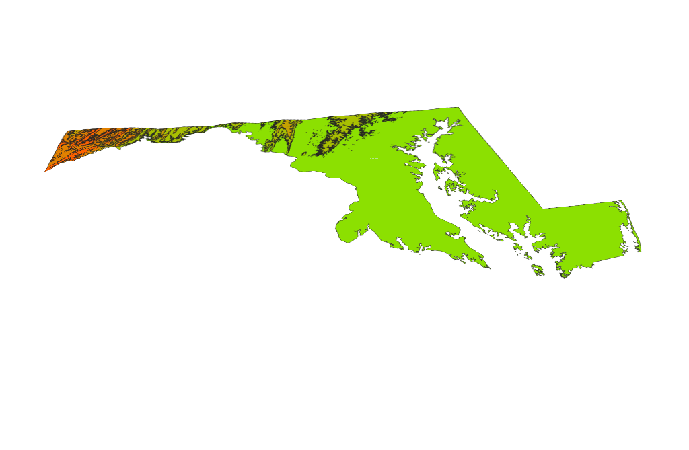
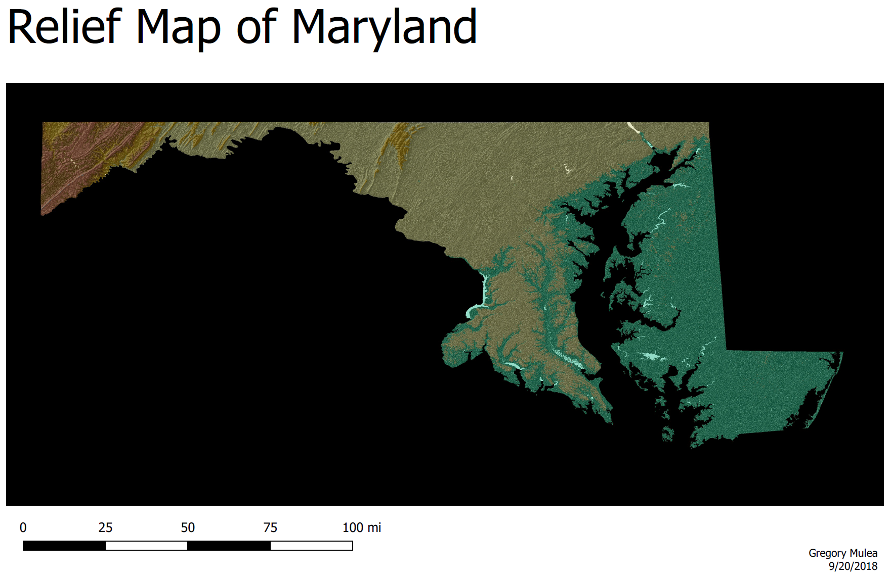
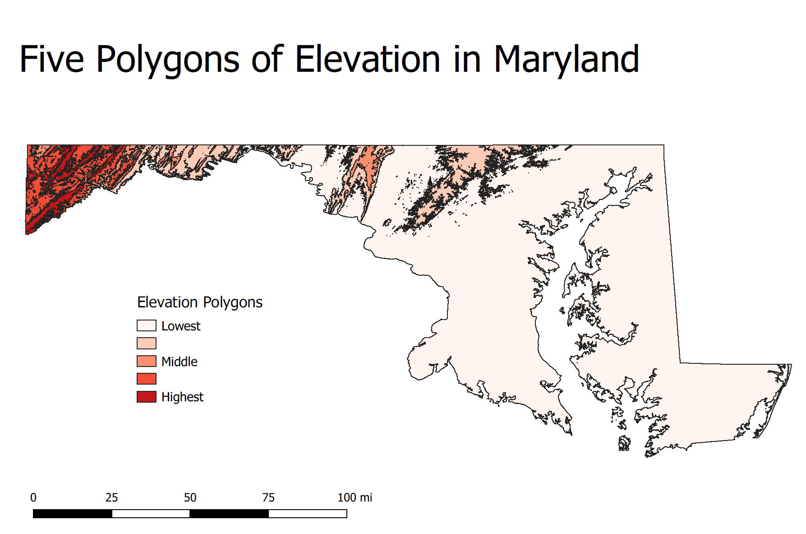

In this Project I used a DEM Tif to create different ways to visualize elevation in Maryland.

### 3D Map of Maryland

This map uses the value of the DEM to create a 3D map of Maryland.  It is color coded to where green is low elevation and red is high elevation areas.

