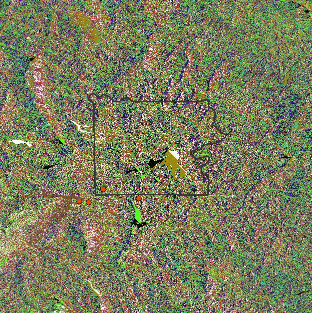
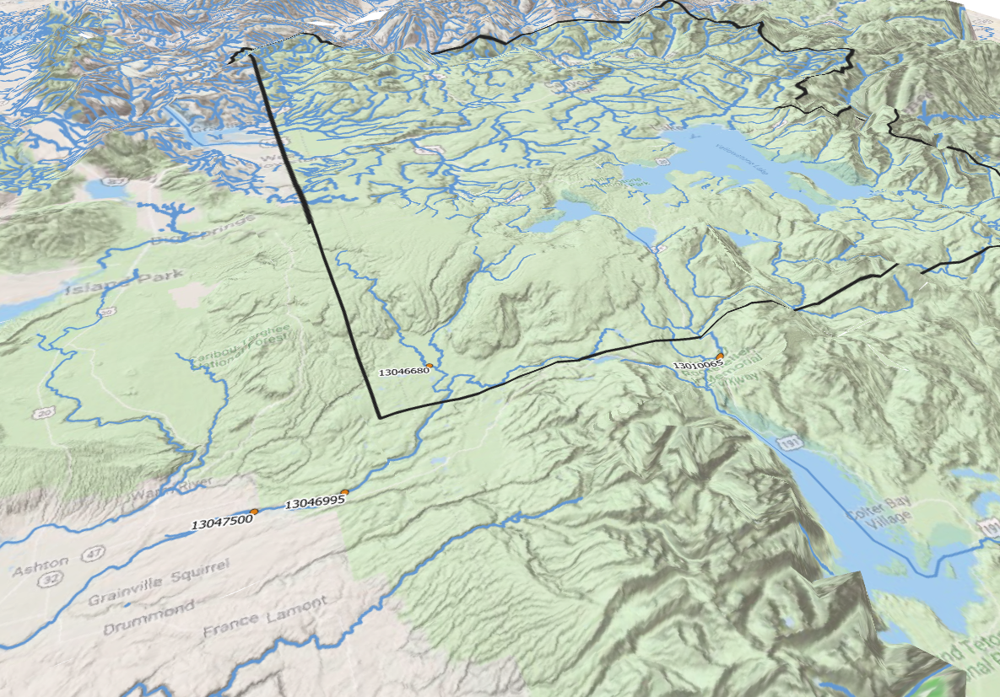

### Proposal

For this project, I will be analyzing annual water flows for rivers and streams in the Yellowstone National Park Area.  I want to figure out if catchment area size affects the rate of snowmelt discharge through streams in the Yellowstone Area.  To do this I will first use SQL to select USGS Stream Gages that within a 10 mile buffer zone of Yellowstone.  Next I will download data from USGS's website and use python to find the max and min disharge values for specific streams and match that to the Gages around Yellowstone.  Using Python, I will create a script to match the max and min values to their respective Gages and update the attribute table.  

My data will come from [DEM of Yellowstone Area](https://viewer.nationalmap.gov/basic/?category=ned#productGroupSearch), [Stream Polyon](http://download.geofabrik.de/north-america.html), [Polygon of USA](https://www.census.gov/geo/maps-data/data/cbf/cbf_state.html), [Polygon of Wyoming and its Counties](http://explorer.geospatialhub.org/geoportal/catalog/search/resource/details.page?uuid=%7B92A25871-C08A-48CF-8EF1-02870081D0C2%7D), [Polygon of Yellowstone](https://www.sciencebase.gov/catalog/item/4ffb3aebe4b0c15d5ce9fc0b), and [USGS Site for Monthly Data from Specific Site Numbers](https://waterdata.usgs.gov/nwis/monthly?referred_module=sw&search_criteria=site_no_file_attachment&submitted_form=introduction)

In addition to using SQL and Python I plan on creating a 3d Map using the DEM file.  Time permitted I will also run a watershed analysis to determine the watershed areas of each stream gage I will use.  

This will be more involved than the labs because It involves using multiple different tools on a large dataset.  It also involves tools I have not yet used (watershed analysis) which I am excited to use.  I choose this project because the Yellowstone Area is very interseting and I wanted to examine the snowmelt processes that drive the Stream Discharge.

### Progress
So far I have selected my area using SQL
```
SELECT sites.ogc_fid, fid_sites, site_no, station_nm, state, st_transform(sites.geometry, 26913) as geometry
FROM sites
JOIN yellowstone_10mile
ON st_intersects(st_transform(sites.geometry, 26913), st_transform(yellowstone_10mile.geometry, 26913))
```
I than downloaded the data from USGS using the Site Numbers of the gages inside the 10 mile buffer area.

Using Python I was able to determine the max an min values and add those to the sites attribute table.
```python
# Layer Containing the USGS Gage Sites
sites = QgsVectorLayer("Z:/486Workspace/project_3/data/10mile_sites.shp",
"", "ogr")

# Layer Containing the Monthly Data from USGS Website
data = QgsVectorLayer("Z:/486Workspace/project_3/data/monthly.csv",
"", "ogr")

# Adding the 4 Fields to Sites Layer (max, min, month_max, and min_max)
field = QgsField('max', QVariant.Double)
sites.startEditing()
sites.dataProvider().addAttributes([field])
sites.updateFields()
idx = sites.dataProvider().fieldNameIndex('max')

field = QgsField('min', QVariant.Double)
sites.startEditing()
sites.dataProvider().addAttributes([field])
sites.updateFields()
idx2 = sites.dataProvider().fieldNameIndex('min')

field = QgsField('month_max', QVariant.Int)
sites.startEditing()
sites.dataProvider().addAttributes([field])
sites.updateFields()
idx3 = sites.dataProvider().fieldNameIndex('month_max')

field = QgsField('month_min', QVariant.Int)
sites.startEditing()
sites.dataProvider().addAttributes([field])
sites.updateFields()
idx4 = sites.dataProvider().fieldNameIndex('month_min')

# Empty Lists for Values from Data File
myM = []
month = []

# For Loop to Cycle Through All Features in Sites
for f in sites.getFeatures():
    # For Loop to Cycle Through All Features in Data
    for f2 in data.getFeatures():
        # If Statement to Check Whether the Site Number Matches
        if f['site_no'] == f2['site_no']:
            # Adds Values to Lists From Data File
            myM.append(float(f2['mean']))
            month.append(f2['month'])
    # If List is Empty Do Nothing
    if not myM:
        print()
    else:
        # Creates a New Sorted List From Original List
        Msort = list(myM)
        Msort.sort()
        # Obtains the Max and Min Values from Sorted List
        max = Msort.pop()
        min = Msort[0]
        # Adds Max and Min Values to Sites File
        f[idx] = max
        f[idx2] = min
        # Find Matching Month for Max and Min Values and Adds it to Sites File
        max_idx = myM.index(max)
        f[idx3] = month[max_idx]
        min_idx = myM.index(min)
        f[idx4] = month[min_idx]
    # Resets Lists to Empty
    myM = []
    month = []
    # Updates Sites File
    sites.updateFeature(f)
# Commits Changes
sites.commitChanges()
```
I have also created a 3D image of the area that includes the four gages for which I have data.  That is below in the results section.

I am currently working on a watershed analysis using ArcMap, as my DEM raster file is huge and posed problems within QGIS.  



### Results

