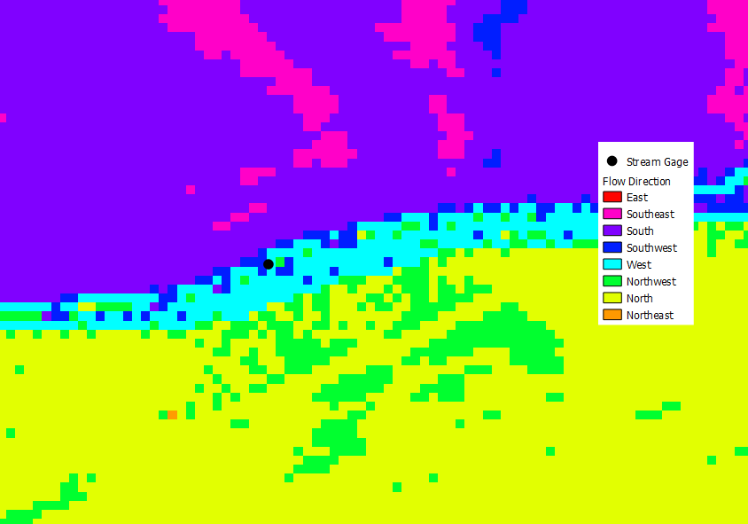
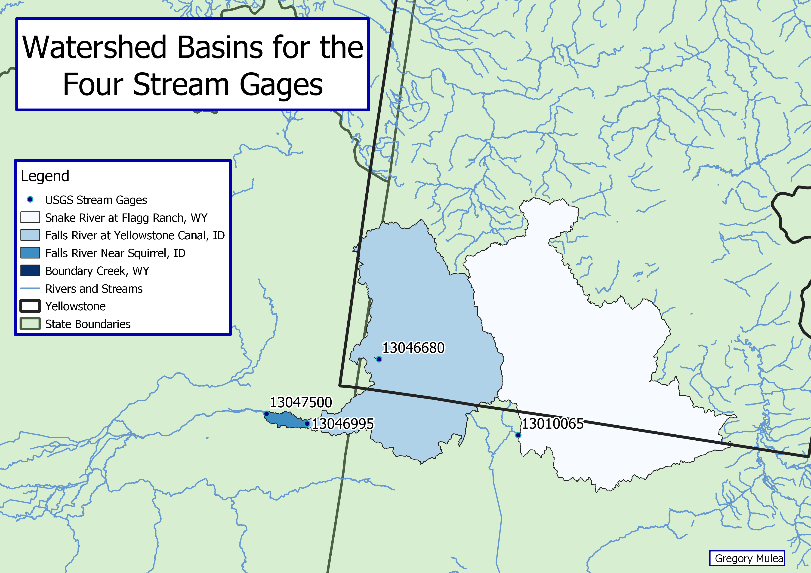
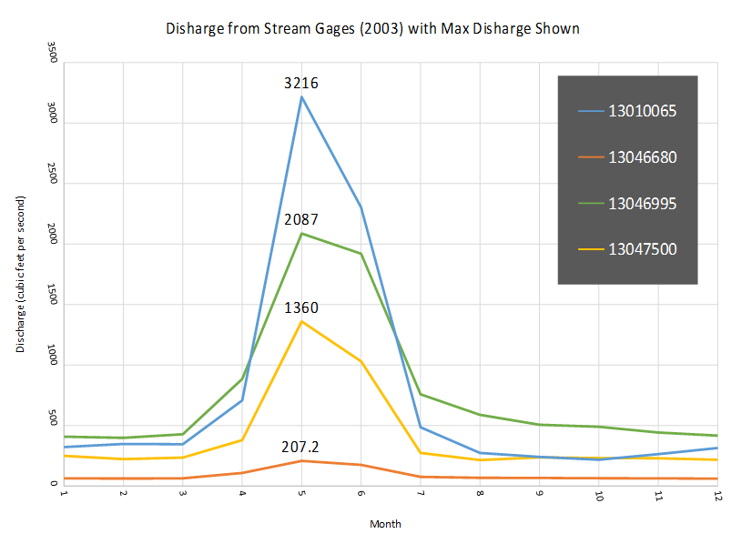
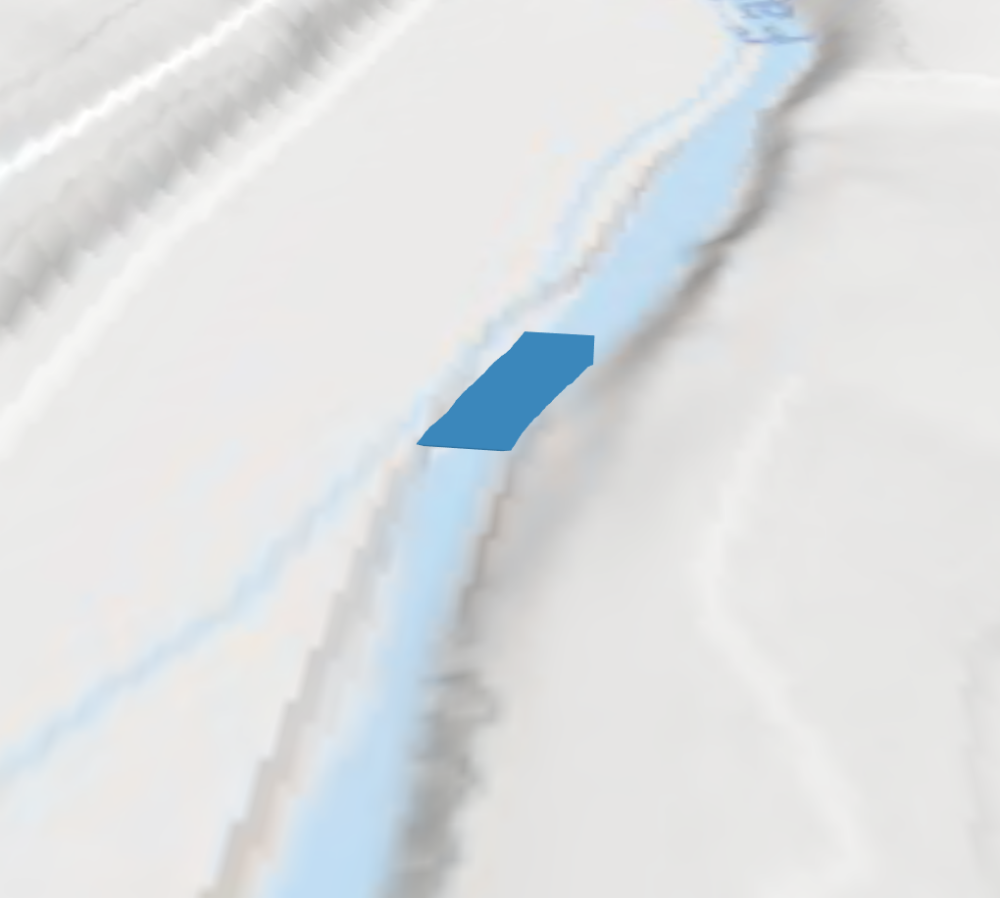
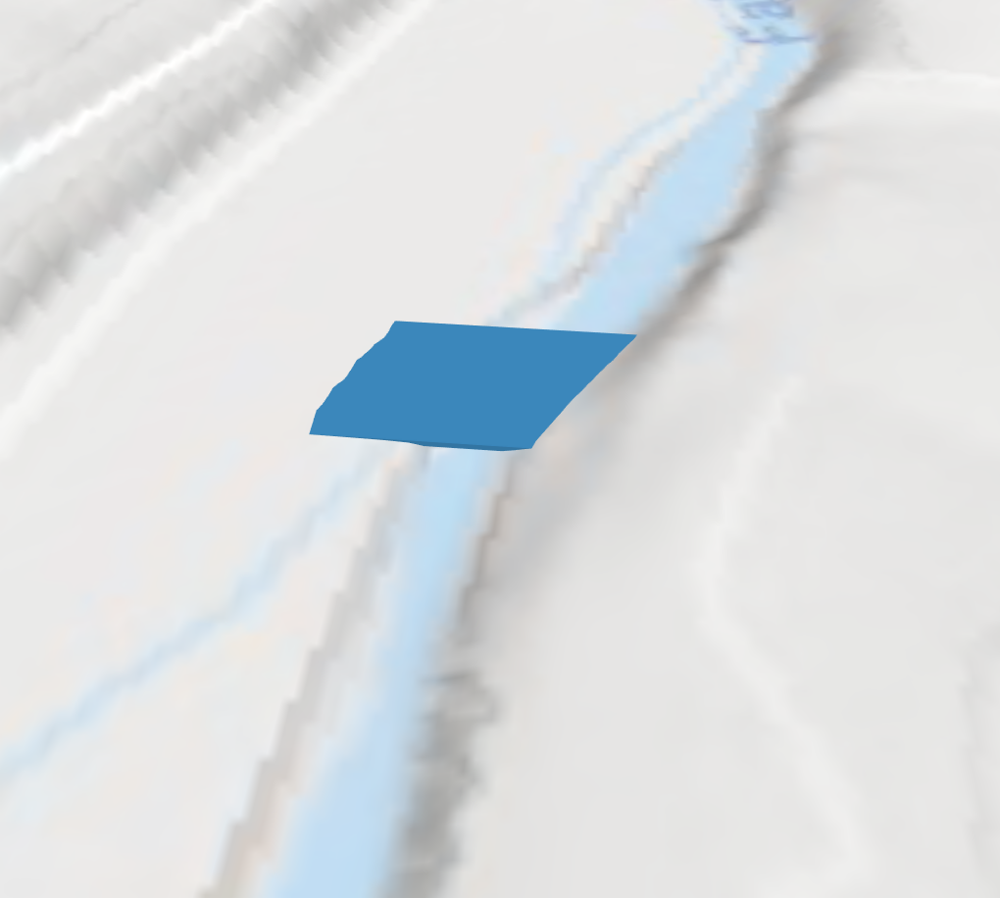
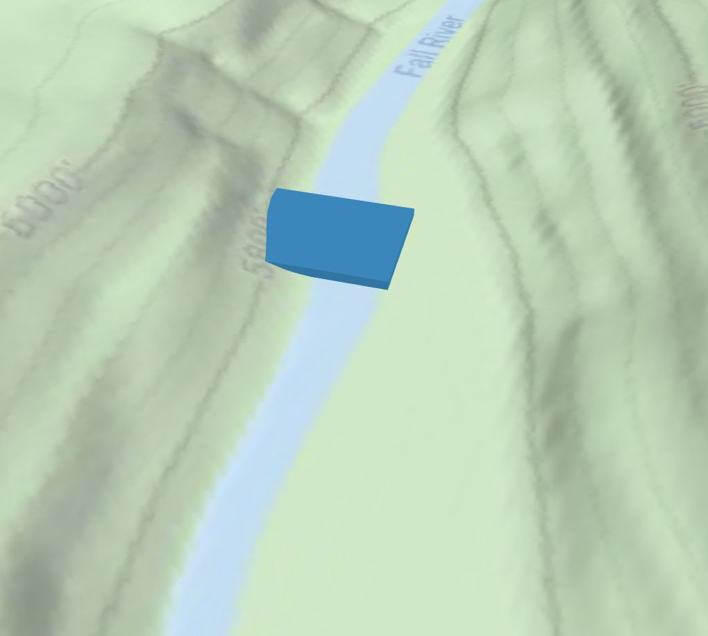

### Proposal

For this project, I will be analyzing annual water flows for rivers and streams in the Yellowstone National Park Area.  I want to figure out if catchment area size affects the rate of snowmelt discharge through streams in the Yellowstone Area.  To do this I will first use SQL to select USGS Stream Gages that within a 10-mile buffer zone of Yellowstone.  Next, I will download data from USGS's website and use python to find the max and min discharge values for specific streams and match that to the Gages around Yellowstone.  Using Python, I will create a script to match the max and min values to their respective Gages and update the attribute table.  

My data will come from [DEM of Yellowstone Area](https://viewer.nationalmap.gov/basic), [Stream Polyon](http://download.geofabrik.de/north-america.html), [Polygon of USA](https://www.census.gov/geo/maps-data/data/cbf/cbf_state.html), [Polygon of Wyoming and its Counties](http://explorer.geospatialhub.org/geoportal/catalog/search/resource/details.page?uuid=%7B92A25871-C08A-48CF-8EF1-02870081D0C2%7D), [Polygon of Yellowstone](https://www.sciencebase.gov/catalog/item/4ffb3aebe4b0c15d5ce9fc0b), and [USGS Site for Monthly Data from Specific Site Numbers](https://waterdata.usgs.gov/nwis/monthly?referred_module=sw&search_criteria=site_no_file_attachment&submitted_form=introduction)

In addition to using SQL and Python, I plan on creating a 3d Map using the DEM file.  Time permitted I will also run a watershed analysis to determine the watershed areas of each stream gage I will use.  

This will be more involved than the labs because It involves using multiple different tools on a large dataset.  It also involves tools I have not yet used (watershed analysis) which I am excited to use.  I choose this project because the Yellowstone Area is very interesting and I wanted to examine the snowmelt processes that drive the Stream Discharge.

### Steps
First, I selected my focus area using SQL
```
SELECT sites.ogc_fid, fid_sites, site_no, station_nm, state, st_transform(sites.geometry, 26913) as geometry
FROM sites
JOIN yellowstone_10mile
ON st_intersects(st_transform(sites.geometry, 26913), st_transform(yellowstone_10mile.geometry, 26913))
```
I then downloaded the data from USGS using the Site Numbers of the gages inside the 10-mile buffer area.

Using Python I was able to determine the max an min values and add those to the sites attribute table.
```python
# Layer Containing the USGS Gage Sites
sites = QgsVectorLayer("Z:/486Workspace/project_3/data/10mile_sites.shp",
"", "ogr")

# Layer Containing the Monthly Data from USGS Website
data = QgsVectorLayer("Z:/486Workspace/project_3/data/monthly.csv",
"", "ogr")

# Adding the 4 Fields to Sites Layer (max, min, month_max, and min_max)
field = QgsField('max', QVariant.Double)
sites.startEditing()
sites.dataProvider().addAttributes([field])
sites.updateFields()
idx = sites.dataProvider().fieldNameIndex('max')

field = QgsField('min', QVariant.Double)
sites.startEditing()
sites.dataProvider().addAttributes([field])
sites.updateFields()
idx2 = sites.dataProvider().fieldNameIndex('min')

field = QgsField('month_max', QVariant.Int)
sites.startEditing()
sites.dataProvider().addAttributes([field])
sites.updateFields()
idx3 = sites.dataProvider().fieldNameIndex('month_max')

field = QgsField('month_min', QVariant.Int)
sites.startEditing()
sites.dataProvider().addAttributes([field])
sites.updateFields()
idx4 = sites.dataProvider().fieldNameIndex('month_min')

# Empty Lists for Values from Data File
myM = []
month = []

# For Loop to Cycle Through All Features in Sites
for f in sites.getFeatures():
    # For Loop to Cycle Through All Features in Data
    for f2 in data.getFeatures():
        # If Statement to Check Whether the Site Number Matches
        if f['site_no'] == f2['site_no']:
            # Adds Values to Lists From Data File
            myM.append(float(f2['mean']))
            month.append(f2['month'])
    # If List is Empty Do Nothing
    if not myM:
        print()
    else:
        # Creates a New Sorted List From Original List
        Msort = list(myM)
        Msort.sort()
        # Obtains the Max and Min Values from Sorted List
        max = Msort.pop()
        min = Msort[0]
        # Adds Max and Min Values to Sites File
        f[idx] = max
        f[idx2] = min
        # Find Matching Month for Max and Min Values and Adds it to Sites File
        max_idx = myM.index(max)
        f[idx3] = month[max_idx]
        min_idx = myM.index(min)
        f[idx4] = month[min_idx]
    # Resets Lists to Empty
    myM = []
    month = []
    # Updates Sites File
    sites.updateFeature(f)
# Commits Changes
sites.commitChanges()
```
I have also created a 3D image of the area that includes the four gages for which I have data.  That is below in the results section.

I did a watershed analysis using ArcMap, as the DEM raster file is huge and posed problems within QGIS.  The first step to a watershed analysis is to use the fill tool in order to get rid of any anomalies in the data.  Then I ran a flow direction tool and got the following raster as an output.


This is a flow map of the Yellowstone Region and it uses the DEM to calculate the direction water will flow from each pixel.



This is zoomed in on the flow map around site 13046995.  You can see the channel in light blue where the water flows West.  Above the channel the water flows South and below the channel the water flows North.

I then ran a flow accumulation tool on the flow direction raster which uses the flow direction raster to calculate the accumulated flow at each pixel.

Lastly, I used the watershed tool to calculate the watershed areas for each stream gage.  Polygonizing the watershed raster I was able to create watersheds for my stream gages.  The output map is below in the results section.

### Results

This is a 3D map of the study area created using QGIS and the Yellowstone DEM.  The stream gages are shown with their matching site number.


This is a map of the area with the stream gages displayed.  The labels on each gage correspond to the site number, max discharge for the year 2003, and the drainage area from USGS.


This is a map of the watershed areas that I calculated using ArcMap.  Because the gage for Boundary Creek (13046680) is so small and rests on a relatively flat area, ArcMap was unable to create a proper area for that point.  For the other points, the actual drainage areas that I calculated from the watershed analysis where only off by a few square miles when compared to the official areas from USGS.


This graph shows the hydrograph for 2003 using the average discharge in CFS for each month.  As you can see, the peak discharge occurs in the month of May for each stream.  This is potentially due to snowmelt, which is what drives much of the discharge in this area.  Although site 13047500 and 13046995 are relatively close to one another and originate from the same watershed, the site further away has a lower max discharge.  My hypothesis for this is due to the terrain in this area leveling out and the channel getting wider and shallower.  To test this I downloaded more data from the USGS website that gave me the depth and width for the gages at the max and minimum discharges in 2003.  Looking at this data it appears that my hypothesis was correct as site 13047500 has a width of 180 feet and a depth of 3.46 feet at max discharge in May 2003, while site 13046995 has a width of 124 feet and a depth of 8.24 feet at the same time.

Using depth and width of the stream gages I created a rough visualization for the stream gages which show the streams at max and min discharge.


This is site 13047500 at its min disharge (top) and max discharge (bottom).


This is site 13046995 at its min disharge (top) and max discharge (bottom).
